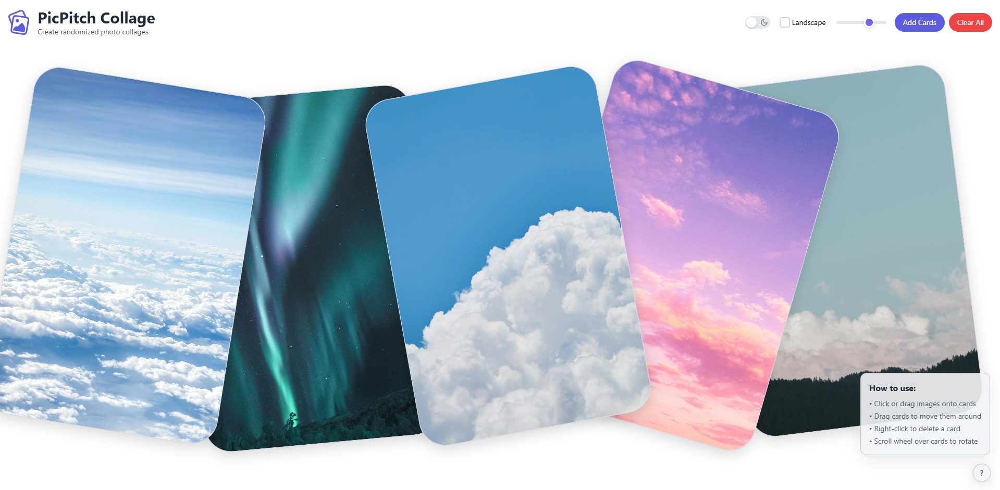

    

# PicPitch

A minimalist image collage creator which looks like tossing photos on a table. Made using vanilla JavaScript and Tailwind CSS.

Drag and drop images onto randomly placed, rotated cards with soft shadows and rounded edges. Includes dark mode, smooth interactions, landscape mode, size adjustment and more. To save the collage, just take a screenshot :)

It works better on wide screen displays and requires a mouse to use. Mobile is also supported, thanks to [@nylla8444](https://github.com/nylla8444) for the help.

🔗 **Demo**: [sammed05.github.io/picpitch-collage](https://sammed05.github.io/picpitch-collage/)

Code licensed under MIT license.
